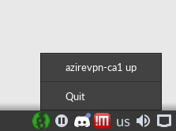

# Simple Wireguard Tray Icon

It shows if a wireguard is up or not.
The right-click menu lists the available wireguard interfaces and if they are up or not.

## Requirements

* bash
* awk
* yad for the systray icon : https://sourceforge.net/projects/yad-dialog/
* iproute2 for ip command

## Usage

Just start `./wireguard-tray.sh` and a system tray icon will spawn

## License

MIT
